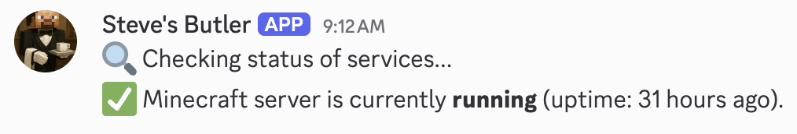
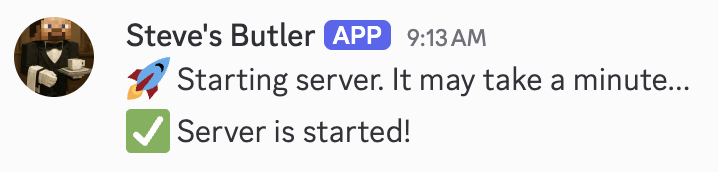
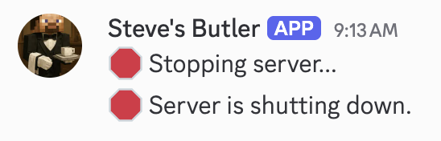

# Steve's Butler - Discord Bot

## Introduction

Steve's Butler is a Discord bot designed to assist with various tasks related to Minecraft Server management right from your Discord server.

Currently, it supports the following features:
- **Server Status**: Check if your Minecraft server is online.
- **Server Start/Stop**: Start or stop your Minecraft server.

## Commands

From any channel in your Discord server, you can use the following commands:
- `@Steve's Butler status`: Check the status of your Minecraft server.
    
- `@Steve's Butler start`: Start your Minecraft server.
    
- `@Steve's Butler stop`: Stop your Minecraft server.

    

## Setup

### Running the bot

1. Build the binary.
   ```bash
   go build -o discordbot
   ```
2. Create a config file named `config.json` in the same directory as the binary based on the provided [config.example.json](./config.example.json) template.
3. Create a Systemd service file `/etc/systemd/system/discordbot.service` for the bot based on the provided [discordbot.example.service](./discordbot.example.service) template.
4. Run the bot using Systemd:
   ```
   sudo systemctl enable discordbot
   sudo systemctl start discordbot
   ```

### Configuration

1. Create an application on the [Discord Developer Portal](https://discord.com/developers/applications).

2. Settings > Bot page
    1. Use "Reset Token" to get a new token for your bot and copy it into the `config.json`.
    2. Enable the `SERVER MEMBERS INTENT` and `MESSAGE CONTENT INTENT`.

3. Settings > OAuth2 page
    1. Under "Scopes", select `bot`.
    2. Under "Bot Permissions", select `Send Messages` and `Read Message History`.
    3. Copy the generated URL and open it in your browser to invite the bot to your server. It should look like this:
       ```
       https://discord.com/api/oauth2/authorize?client_id=YOUR_CLIENT_ID&permissions=67584&integration_type=0&scope=bot
       ```

4. In your discord server, create a role and add members that you want to have access to the bot.
5. [Enable Developer Mode](https://discord.com/developers/docs/activities/building-an-activity#step-0-enable-developer-mode) in Discord settings.
6. Right-click on the role you created and select "Copy ID". Paste this ID into the `config.json` file under the `allowed_roles` section.
